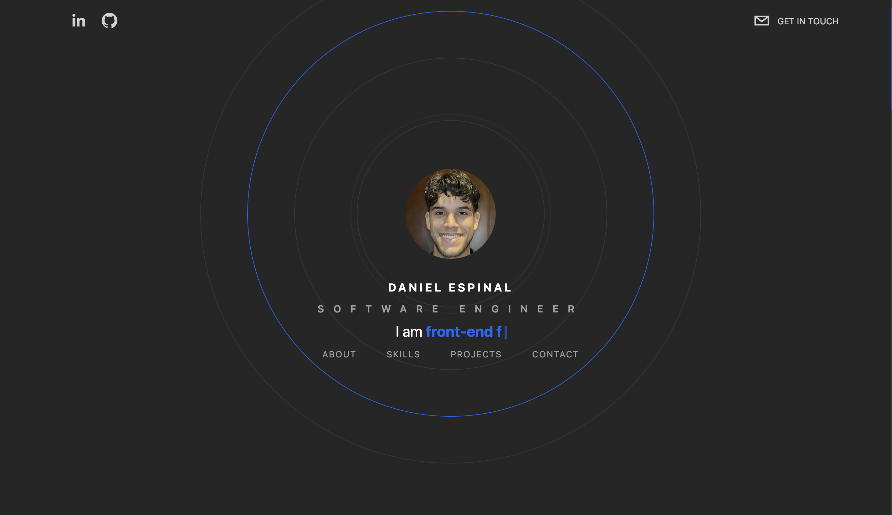

# Portfolio Website

## Description

My name is Daniel, and I am a Frontend Software Engineer located in New York. I bring a passion for developing user-centered and aesthetically pleasing digital experiences. Proficient in HTML, CSS, JavaScript, and React, I have hands-on experience in creating responsive websites, building UI components, and implementing interactivity. Proven track record of working effectively with other software engineers in a fast-paced, deadline-driven environment, consistently delivering quality work. My strong problem-solving skills and attention to detail make me an asset to any team looking for a proactive and dedicated developer. Seeking opportunities to continue honing my craft and grow as a professional in the tech industry!

This website was built using Next.js, React, TypeScript, Tailwindcss, and Framer Motion.
